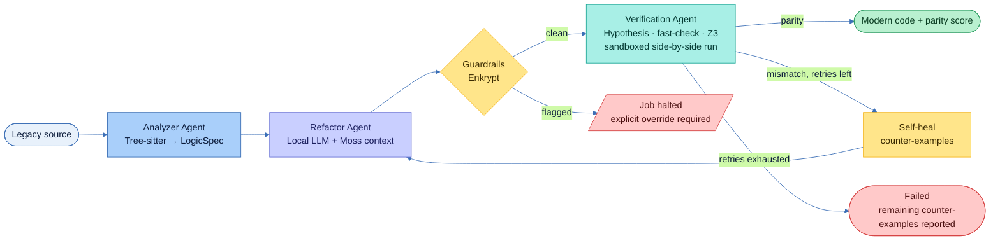
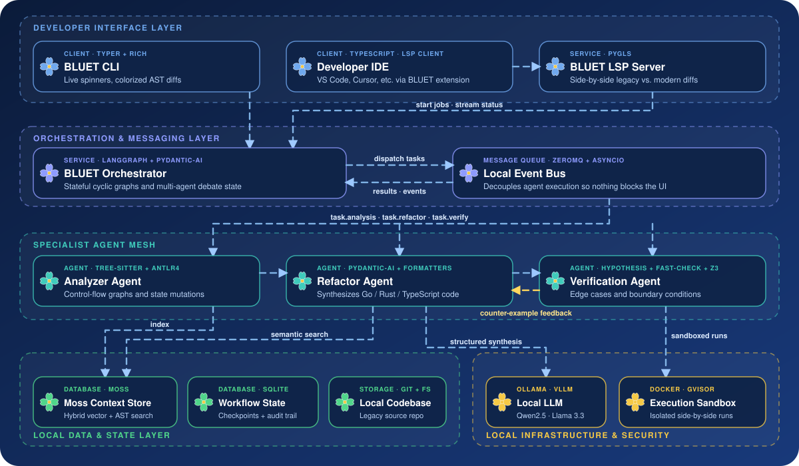

<div align="center">


<br/>

<p>
  <a href="#-roadmap"></a>
  <a href="#-quick-start"></a>
  <a href="#-security-and-isolation-model"></a>
  <a href="#-local-inference"></a>
  <a href="#-platform-support"></a>
  <a href="#-license"></a>
</p>

**BLUET analyzes legacy code, synthesizes a modern equivalent with a local LLM, and then _proves_ behavioral parity by running both versions side by side in an isolated sandbox.**
**When they disagree, it feeds the counter-example back to the model and tries again.**

[🌱 Why BLUET](#-why-bluet) · [🌸 How it works](#-how-it-works) · [🧱 Architecture](#-architecture) · [🚀 Quick start](#-quick-start) · [🧰 CLI](#-cli-reference) · [🔐 Security](#-security-and-isolation-model) · [🧭 Roadmap](#-roadmap)

</div>


## 🌱 Why BLUET

Rewriting legacy systems is risky for one reason: nobody can prove the new code behaves like the old code. Most AI-assisted migration tools generate a rewrite and leave verification to you.

BLUET treats verification as the product, not an afterthought.

| | |
|---|---|
| 🎯 **Parity, not plausibility** | Every generated function runs against the original on the same generated inputs, and outputs are compared for exact equality. |
| 🔁 **Self-healing** | A mismatch becomes a structured counter-example that is fed back to the synthesis agent, which regenerates and re-verifies (bounded retries). |
| 🔒 **Your code stays home** | Inference runs locally on Ollama or vLLM. Verification runs in a sandbox with no network access. |
| 🔍 **Honest about risk** | Non-deterministic behavior (file, network, raw JDBC), type coercion, and lossy language mappings are flagged in the analysis and shown in the diff, never papered over. |

## 🌼 Features

| Capability | Details |
|---|---|
| 🔬 **Structural analysis** | Tree-sitter parsing into a language-neutral `LogicSpec`: functions, control-flow graph, state mutations, and flagged non-deterministic calls, all per function. |
| 🧠 **Local LLM synthesis** | Pydantic-AI enforces schema-valid output. The model tier is auto-selected from detected VRAM or unified memory and can be auto-pulled on first run. |
| ✅ **Behavioral verification** | Property-based tests (Hypothesis for Python targets, fast-check for TypeScript targets) run legacy and modern code side by side. Z3 covers numeric boundary and branch-coverage constraints. |
| 🩹 **Self-healing loop** | Counter-examples name the failing function, inputs, expected and actual output, and a diff summary. Retries are bounded (`MAX_RETRIES = 3`). |
| 📦 **Sandboxed execution** | Docker + gVisor (`runsc`) when available; hardened Docker with a visible warning otherwise. Never falls back to unsandboxed execution. |
| 🛡️ **Inline guardrails** | Enkrypt inspects the refactor agent's inputs and outputs for secrets, prompt injection, and OWASP-flagged patterns. Findings halt the job until you explicitly override. |
| ⚡ **Fast context retrieval** | Moss hybrid vector + AST search supplies relevant codebase context to the refactor agent. |
| 💾 **Resumable jobs** | LangGraph checkpoints and an audit trail persist to SQLite; jobs pause and resume across restarts. |
| 🧑‍💻 **Developer tooling** | Rich-powered CLI, a pygls Language Server, and a VS Code extension with live parity status and native side-by-side diffs. |


## 🌸 How it works

A bluet has four petals. So does BLUET's pipeline, and the golden heart in the middle is the thing everything exists to protect: **verified parity**.

<div align="center">

</div>

| Petal | Stage | What happens |
|:---:|---|---|
| 🔵 **1** | **Analyze** | The Analyzer Agent parses each file into a structured `LogicSpec`. The spec is per function, which lets downstream stages target failures precisely. File-level summary fields are derived from the per-function data so the two views cannot drift apart. |
| 🟣 **2** | **Synthesize** | The Refactor Agent combines the `LogicSpec`, relevant Moss context, and Jinja2 boilerplate templates, then asks the local model for a schema-validated `ProposedCode`. Output is passed through the target language's formatter (`gofmt`, `rustfmt`, or `prettier`). |
| 🟢 **3** | **Verify** | The Verification Agent generates property-based tests per function and executes the legacy and proposed code in separate sandboxed containers on identical inputs. Any mismatch becomes a `CounterExample`. |
| 🟡 **↻** | **Self-heal** | On failure, counter-examples go back to the Refactor Agent, which regenerates the file and re-verifies. After the retry budget is spent, the job ends in a failure state and reports what remains unresolved. |
| 💛 | **Parity** | The golden heart. A parity score per module, plus the modern code, ready for `bluet diff`. |

The whole flow is a stateful LangGraph graph. Agents communicate over an asyncio + ZeroMQ event bus, so the UI stays responsive during long verification runs, and every event is written to an audit trail in SQLite.

<details>
<summary><b>🔎 Full flow, including guardrail halts</b></summary>

<br/>



</details>

## 🧱 Architecture

BLUET is organized as five local layers. Nothing in this diagram calls out to a hosted service: the orchestrator, agents, model, context store, and sandbox all run on your machine.

<div align="center">

</div>

| Layer | Components | Responsibility |
|---|---|---|
| 🔵 **Developer interface** | BLUET CLI (Typer, Rich) · Developer IDE with the BLUET extension (VS Code, Cursor, etc.; TypeScript, LSP client) · BLUET LSP Server (pygls) | Start jobs, stream live status, and review side-by-side legacy vs. modern diffs from the terminal or the editor. |
| 🟣 **Orchestration & messaging** | BLUET Orchestrator (LangGraph, Pydantic-AI) · Local Event Bus (ZeroMQ, asyncio) | Runs stateful, cyclic graphs and multi-agent debate state. The event bus decouples agent execution so long verification runs never block the UI. |
| 🟢 **Specialist agent mesh** | Analyzer Agent (Tree-sitter, ANTLR4) · Refactor Agent (Pydantic-AI, `gofmt` / `rustfmt` / `prettier`) · Verification Agent (Hypothesis, fast-check, Z3) | Analyzer extracts control-flow graphs and state mutations; Refactor synthesizes Go, Rust, or TypeScript with structured output; Verification hunts edge cases and boundary conditions and returns counter-examples to Refactor. |
| 🟡 **Local infrastructure & security** | Local LLM (Ollama, vLLM; Qwen2.5-Coder, Llama 3.3) · Execution Sandbox (Docker, gVisor, docker-py) | Local inference for synthesis, and isolated side-by-side execution of legacy and modern code. |
| 🟩 **Local data & state** | Moss Context Store (hybrid vector + AST search) · Workflow State (SQLite, SQLAlchemy 2.0 async) · Local Codebase (Git / local filesystem) | Sub-3 ms retrieval target for codebase context, agent negotiation logs and intermediate AST states, and the legacy source under refactor. |

**Key flows**

- 🔹 **Dispatch.** The orchestrator publishes `task.analysis`, `task.refactor`, and `task.verify` on the event bus; agents pick up work and publish results back.
- 🔹 **Semantic search.** Analyzer indexes AST nodes and embeddings into Moss; Refactor queries it for relevant codebase context before generating code.
- 🔹 **Structured synthesis.** Refactor calls the local LLM through Pydantic-AI and receives schema-validated output.
- 🔹 **Sandboxed runs.** Verification executes legacy and modern code side by side in the sandbox.
- 🔸 **Counter-example feedback.** Mismatches flow back from Verification to Refactor, closing the self-healing loop.
- 💾 **Persistence.** Job state, checkpoints, and events are written to SQLite, so jobs resume after a restart.

## 🌿 Supported languages

| Source language | Analysis | Synthesis + verification | Notes |
|---|---|---|---|
| 🐍 **Python 2** | Tree-sitter | Property-based (Hypothesis / fast-check) | Reference implementation of the pipeline. |
| ☕ **Java 8** | Tree-sitter | Property-based (fast-check for TS targets) | Raw JDBC and untyped `Map` usage are flagged as non-deterministic and type-coercion risks. |
| 🏛️ **COBOL** | ANTLR4 | Property-based | Fixed-point decimal arithmetic, `GOTO` control flow, and `PERFORM` loops need special handling; some mappings are lossy and documented as such. See [Known limitations](#-known-limitations). |

Target languages are selected per job. Output formatting is handled by `gofmt`, `rustfmt`, or `prettier` depending on the target.


## 🚀 Quick start

### Prerequisites

- **Python 3.11+** and [`uv`](https://docs.astral.sh/uv/) (`pip` works as a fallback)
- **Docker**, required. [gVisor](https://gvisor.dev/docs/user_guide/install/) is strongly recommended
- **Ollama** or **vLLM** for local inference
- **Windows only:** WSL2 with a running distro

> [!IMPORTANT]
> BLUET will not run verification without Docker. There is deliberately no unsandboxed fallback.

### Install

```bash
git clone https://github.com/<owner>/bluet.git
cd bluet

uv sync              # or: pip install -e .
```

### Check your environment

```bash
bluet doctor
```

`bluet doctor` verifies Docker, tests for gVisor, picks the isolation backend, and prints a summary of the resource limits in effect.

### Run a modernization job

```bash
bluet run path/to/legacy/file.py     # analyze → synthesize → verify → self-heal
bluet status <job_id>                # state, backend, latest events
bluet diff <job_id>                  # side-by-side diff + parity score
```

## 🧰 CLI reference

| Command | Description |
|---|---|
| `bluet doctor` | Preflight for Docker and gVisor. Selects the isolation backend and caches the result. Also runs (non-blocking) at the start of `bluet run`. |
| `bluet run <path>` | Creates a job and runs the pipeline on a file or directory, with live progress driven by the event bus. Blocks if Docker is unavailable. Use `-y` / `--yes` to auto-accept model downloads in non-interactive environments. |
| `bluet status <job_id>` | Shows job state, the active isolation backend, and the latest events. |
| `bluet diff <job_id>` | Colorized side-by-side diff of legacy versus proposed code, the parity score, and any remaining counter-examples. `--export <file>` writes it to disk. |

## ⚙️ Configuration

| Variable | Purpose | Default |
|---|---|---|
| `BLUET_LLM_BACKEND` | Inference backend: `ollama` or `vllm`. | Try Ollama, fall back to vLLM |
| `BLUET_LLM_MODEL` | Force a specific model regardless of detected hardware. | Auto-selected by hardware tier |
| `BLUET_DOCTOR_CACHE` | Path of the `bluet doctor` result cache. | `~/.bluet/doctor.json` |

Sandbox resource limits (memory, CPU, and the hardened-Docker flags) are configurable. Job state lives in `.bluet/state.db`, relative to the repository being refactored.

## 🧠 Local inference

BLUET talks to Ollama (`localhost:11434`) or vLLM (`localhost:8000`) and picks a model that fits your hardware:

| Detected hardware | Default model |
|---|---|
| 🟢 24 GB+ VRAM | `qwen2.5-coder:32b-instruct-q4_K_M` |
| 🟡 16–20 GB VRAM | `qwen2.5-coder:14b-instruct-q4_K_M` |
| 🟠 Under 16 GB VRAM / no GPU | `qwen2.5-coder:7b` or `deepseek-coder-v2:16b` |
| 🍎 Apple Silicon (unified memory) | Sized from total system RAM: 32 GB+ mid tier, 16–24 GB small tier, under 16 GB smallest viable model |

The reference architecture targets Qwen2.5-Coder-32B-Instruct and Llama-3.3-70B-Instruct; any model served by Ollama or vLLM can be forced with `BLUET_LLM_MODEL`.

If the recommended model isn't installed, BLUET offers to pull it with a live progress bar, or to continue with a lighter model you already have. In non-interactive sessions it falls back to the lighter model and prints a warning, so a skipped preference is never silent.


## 🔐 Security and isolation model

BLUET executes untrusted legacy code and model-generated code, so isolation is a hard requirement rather than a setting.

| Backend | When used | Isolation |
|---|---|---|
| 🟢 `gvisor` | Docker and `runsc` both available | User-space kernel via gVisor. Strongest boundary. |
| 🟡 `hardened-docker` | Docker available, gVisor missing | `--network none --read-only --cap-drop=ALL --memory=2g`. A visible warning states that isolation is weaker than gVisor. |
| 🔴 *(none)* | Docker unreachable, or Windows without WSL2 | **BLUET refuses to run.** There is no unsandboxed fallback. |

The active backend is recorded on every job and surfaced in `bluet status`, not just written to a log.

- **Guardrails.** Enkrypt sits inline around the refactor step. It scans inputs for hardcoded secrets and injection attempts, and scans generated code for OWASP-flagged patterns before anything is written to disk. A finding halts the job and records a `GuardrailEvent`; continuing requires an explicit CLI override.
- **Data locality.** With local inference, source code is not sent to any third-party model API.

## 🔬 What verification does and does not prove

BLUET aims to be precise about its guarantees.

- ✅ **Covered:** Exact output parity between legacy and modern code across generated inputs, checked per function in a sandbox. Z3 additionally checks numeric boundary conditions and simple branch-coverage constraints.
- ⚠️ **Not covered:** Property-based testing samples the input space; it does not exhaustively prove equivalence. Z3 is applied to a defined subset and does **not** perform full program-equivalence checking.
- 🔍 **Surfaced, not hidden:** Non-deterministic calls (file, network, JDBC), type-coercion risks, and lossy language mappings appear as flagged items in the `LogicSpec` and in `bluet diff`.

> [!NOTE]
> Treat a passing parity score as strong evidence, and review flagged items before shipping.

## 🧑‍💻 Editor integration

- **Language Server** (`pygls`): code actions to start a refactor job on the open file, live `bluet/parityStatus` notifications as the job progresses, and inline diagnostics on functions with unresolved counter-examples.
- **VS Code extension**: status-bar parity status and VS Code's native side-by-side diff view, backed by the same Language Server. Works in VS Code and compatible IDEs such as Cursor.

## 🌳 Project structure

```
bluet/
├── cli/            # Typer + Rich commands: doctor, run, status, diff
├── orchestrator/   # LangGraph state machine, ZeroMQ/asyncio event bus
├── agents/
│   ├── analyzer/   # Tree-sitter / ANTLR4 parsers → LogicSpec
│   ├── refactor/   # Prompting, templates, formatter integration
│   └── verifier/   # Property tests, Z3, side-by-side execution
├── context_store/  # Moss hybrid vector + AST retrieval
├── guardrails/     # Enkrypt inline proxy
├── sandbox/        # Platform detection, Docker / gVisor execution
├── state/          # SQLAlchemy 2.0 models and DAO layer
└── lsp/            # pygls language server
tests/              # Unit, integration, and legacy-code fixtures
vscode-extension/   # VS Code client (TypeScript)
```

## 🧪 Tech stack

<p>
  
  
  
  
  
  
  
  
  
  
  
  
  
  
  
  
</p>

## 💻 Platform support

| Platform | Status | How commands are invoked |
|---|---|---|
| 🐧 Linux | Supported | Native Docker |
| 🍎 macOS | Supported | Docker Desktop |
| 🪟 Windows | Supported via WSL2 | `wsl.exe docker ...` |

Invocation mode (how Docker is reached on your OS) and isolation backend (gVisor or hardened Docker) are independent: any OS can run either backend.


## 🧭 Roadmap

<!-- Tick items as they land. Keep this section accurate; reviewers read it. -->

- [ ] 🌱 **Phase 0: Foundations.** Project scaffold, platform detection, `bluet doctor`
- [ ] 🌿 **Phase 1: Core engine.** State layer, event bus, LangGraph orchestrator, Python + Java analyzers, Moss context store, `bluet run` / `bluet status`
- [ ] 🌸 **Phase 2: Synthesis and verification.** Local LLM client, Refactor and Verification agents, Enkrypt guardrails, `bluet diff`, Java 8 extension
- [ ] 🌼 **Phase 3: Developer experience.** Language Server, VS Code extension
- [ ] 💐 **Phase 4: Enterprise hardening.** Production sandbox wiring, Alembic migrations, COBOL support

## 🚧 Known limitations

- **COBOL parity is harder than Python or Java.** Fixed-point decimal semantics, `GOTO`-driven control flow, and `PERFORM` loops do not map cleanly onto modern languages. Where the mapping is lossy or uncertain, BLUET documents it rather than smoothing it over.
- **Whole-file regeneration on self-heal.** Each retry regenerates the entire file rather than patching a single function. Very large multi-method classes are the most likely place this needs to evolve.
- **Sampling-based verification.** See [What verification does and does not prove](#-what-verification-does-and-does-not-prove).
- **Model quality varies with hardware.** Smaller local models may need more self-heal iterations.

## 🛠️ Development

```bash
make install   # install dependencies
make test      # run the test suite
make lint      # lint
make run       # run the CLI
```

Integration tests that exercise real containers need a running Docker daemon and are skippable in CI when Docker is unavailable.

## 🤝 Contributing

Issues and pull requests are welcome. Please run `make test` and `make lint` before submitting, and include tests with any behavior change.

## 📄 License

<!-- TODO: choose and add a LICENSE file, then update this section and the badge above. -->

License to be announced.

> [!WARNING]
> **Third-party notice:** BLUET integrates [Moss](https://github.com/moss-dev), which is distributed under the PolyForm Shield license (source-available, with restrictions on competing commercial use). Review its terms with your legal or compliance team before redistributing or embedding BLUET in a commercial product.

<br/>


